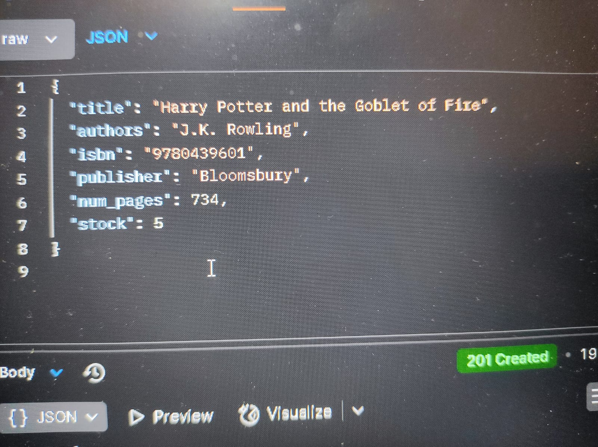

# 8848_digital_machine_test
# 8848_digital_machine_test

# Library Management Web Application (Backend)

This is a backend system for managing a local library using Django and Django REST Framework. It helps librarians perform essential operations like managing books, members, issuing and returning books, rent fee calculation, and importing books from an external API (Frappe Library API).

---

## Features

- Book Management (CRUD)
- Member Management (CRUD)
- Book Issue & Return with rent fee calculation
- Search books by title or author
- Import books from Frappe API
- Rent logic: ₹10 per day
- Debt check: Block return if total debt exceeds ₹500

---

## Tech Stack

- Python 3
- Django 4.x
- Django REST Framework
- SQLite (or any DB)
- Frappe Library API
- Postman for API testing

---

## Setup Instructions

1. **Clone the repository**
   ```bash
   git clone https://github.com/yourusername/library-management.git
   cd library-management
   ```

2. **Create a virtual environment**
   ```cmd
   python -m venv myenv
   .\myenv\Scripts\activate
   ```

3. **Install dependencies**
   ```cmd
   pip install -r requirements.txt
   ```

4. **Apply migrations**
   ```cmd
   python manage.py migrate
   ```

5. **Run the server**
   ```cmd
   python manage.py runserver
   ```

6. **Test the APIs using Postman**

---

## API Endpoints
___________________________________________________________________________________
|           Feature             |         Endpoint          |       Method        |
|-------------------------------|---------------------------|---------------------|
| List/Add Books                | `/api/books/`             | GET / POST          |
| Get/Update/Delete Book        | `/api/books/<id>/`        | GET / PUT / DELETE  |
| List/Add Members              | `/api/members/`           | GET / POST          |
| Get/Update/Delete Member      | `/api/members/<id>/`      | GET / PUT / DELETE  |
| Issue a Book                  | `/api/issue/`             | POST                |
| Return a Book                 | `/api/return/`            | POST                |
| Search Book                   | `/api/search/?q=<query>`  | GET                 |
| Import Books from Frappe API  | `/api/import-books/`      | POST                |
|_______________________________|___________________________|_____________________|

---

## Sample Postman API Requests

### Add Book
```json
POST /api/books/
{
  "title": "Harry Potter and the Goblet of Fire",
  "authors": "J.K. Rowling",
  "isbn": "9780439601",
  "publisher": "Bloomsbury",
  "num_pages": 734,
  "stock": 5
}

```

### Add Member
```json
POST /api/members/
{
  "name": "Harsh Harilal Gupta",
  "email": "harsh@example.com"
}
```

### Issue Book
```json
POST /api/issue/
{
  "member_id": 1,
  "book_id": 1
}
```

### Return Book
```json
POST /api/return/
{
  "member_id": 1,
  "book_id": 1
}

```


### Import Books
```json
POST /api/import-books/
{
    "title": "harry",
  "count": 10
}
```

### Screenshots
    
### Add Book


---

##  Author

**Harsh Gupta**  
[GitHub](https://github.com/HarshGupta29112002/)  
Email: harshgupta0209@gmail.com

---